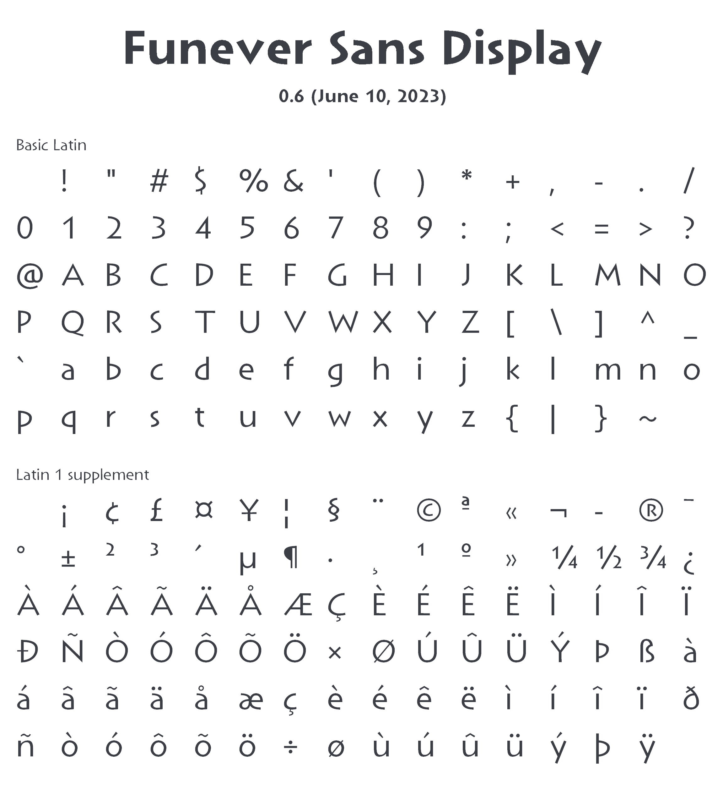
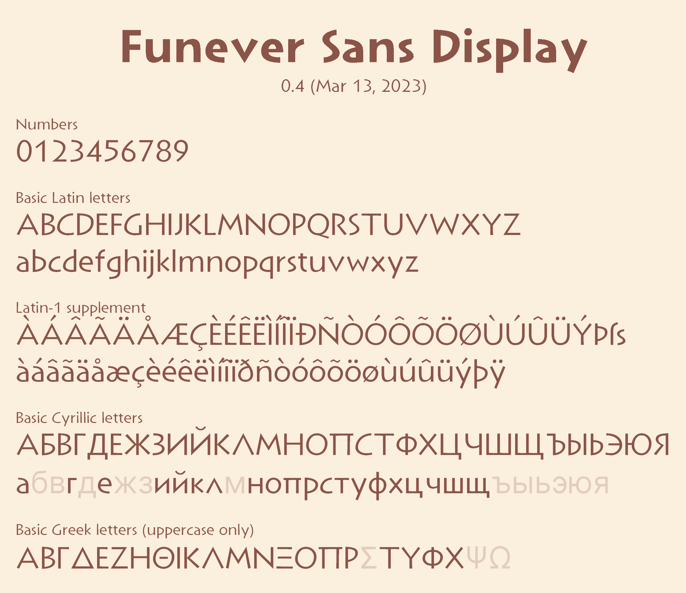
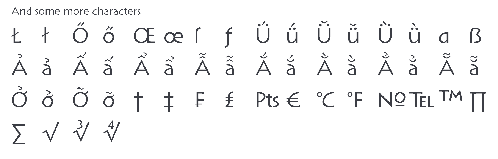

# Funever Sans Display
## Overview
**Funever Sans Display** is an open source sans-serif font with an ancient Greek inscription style. (Similar font and inspiration: [Lithos](https://fonts.adobe.com/fonts/lithos))

## Font files
See here: [preview](https://github.com/AlloyDome/Funever-Sans/tree/main/preview)

## License
OFL-1.1 license.

## Sample
<picture>
    <source media="(prefers-color-scheme: dark)" srcset="./doc/preview1dark.png">
    <source media="(prefers-color-scheme: light)" srcset="./doc/preview1.png">
    
</picture>
<picture>
    <source media="(prefers-color-scheme: dark)" srcset="./doc/preview2dark.png">
    <source media="(prefers-color-scheme: light)" srcset="./doc/preview2.png">
    
</picture>
<picture>
    <source media="(prefers-color-scheme: dark)" srcset="./doc/preview3dark.png">
    <source media="(prefers-color-scheme: light)" srcset="./doc/preview3.png">
    
</picture>
