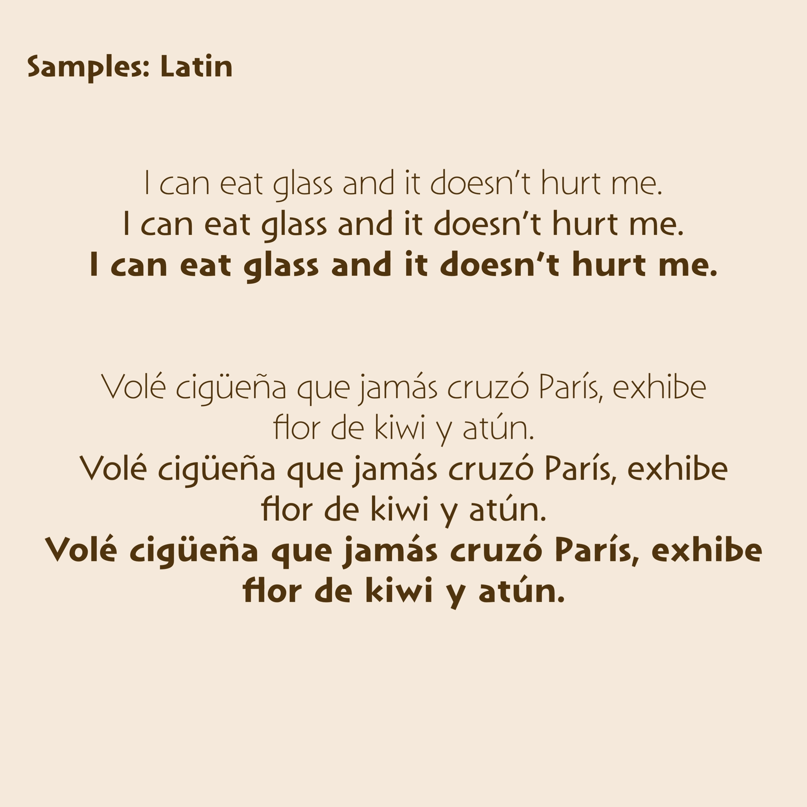
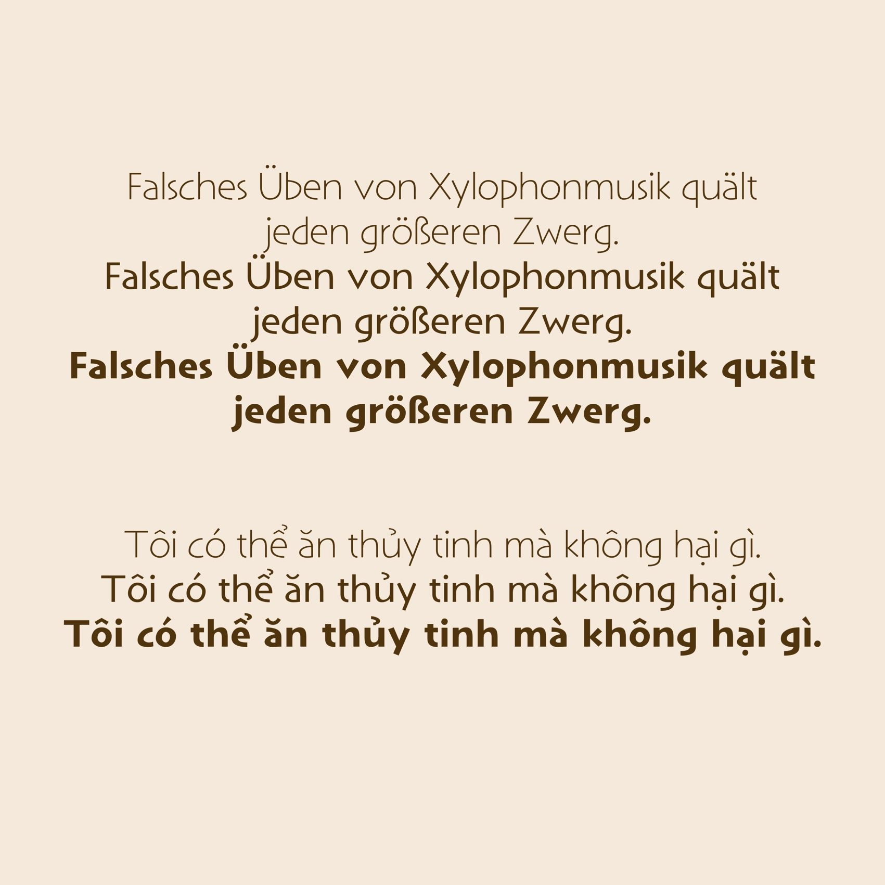
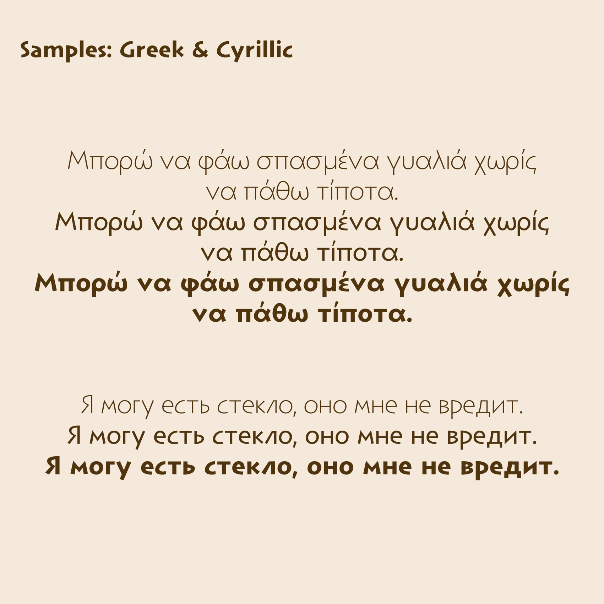

# Funever Sans Display
## Overview
**Funever Sans Display** is an open source sans-serif font with an ancient Greek inscription style. (Similar font and inspiration: [Lithos](https://fonts.adobe.com/fonts/lithos))

## Font files
See here: [preview](https://github.com/AlloyDome/Funever-Sans/tree/main/preview)

## License
OFL-1.1 license.

## Sample

